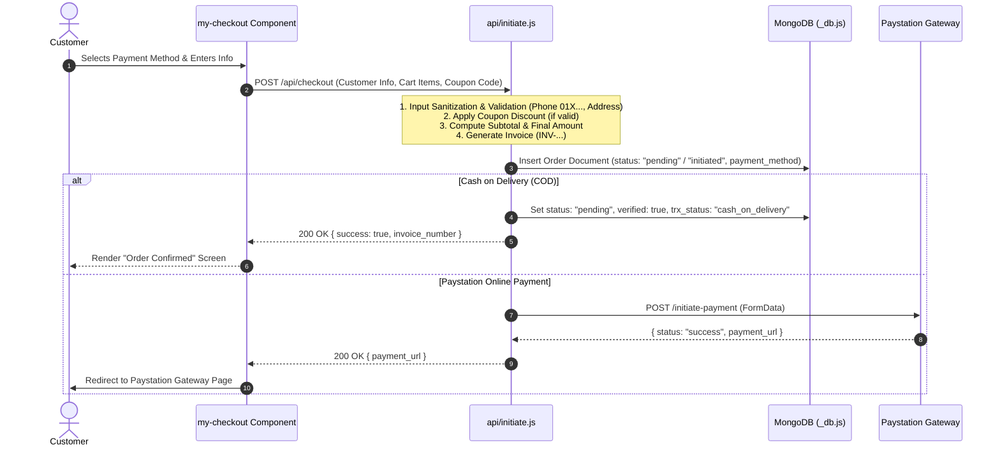
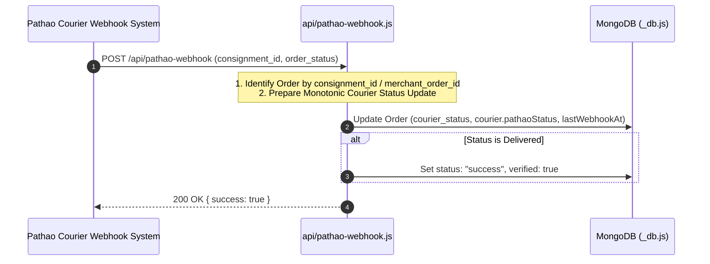

# API Data Flow Map, Admin Panel Integration & Pathao Courier Architecture

This document provides a comprehensive architecture report, data flow map, database schemas, and admin panel integration details for the **Rawgadz** serverless application, Paystation payment gateway, and **Pathao Courier Merchant API v1** integration.

---

## 1. System Architecture Diagram

```mermaid
flowchart TD
    Client["Client Browser\n(Lit Web Components: my-checkout, admin-dashboard)"]
    
    subgraph API ["Vercel Serverless API (/api)"]
        CheckoutEndpoint["/api/checkout\n(api/checkout.js, api/initiate.js)"]
        CouponEndpoint["/api/coupon\n(api/coupon.js)"]
        OrderEndpoint["/api/order\n(api/order.js)"]
        PathaoDispatch["/api/admin/pathao\n(api/admin/pathao.js)"]
        PathaoLocations["/api/pathao-locations\n(api/pathao-locations.js)"]
        PathaoWebhook["/api/pathao-webhook\n(api/pathao-webhook.js)"]
        PathaoClient["Pathao Client Helper\n(api/_pathao.js)"]
        DBHelper["DB Module\n(api/_db.js)"]
      end
    
    Database[(MongoDB\npaystationdemo)]
    PayStation[Paystation Gateway\napi.paystation.com.bd]
    PathaoAPI[Pathao Courier API v1\ncourier-api-sandbox.pathao.com]
    
    %% Flows
    Client -->|1. Submit Order (COD / Paystation)| CheckoutEndpoint
    Client -->|Validate Coupon| CouponEndpoint
    CheckoutEndpoint -->|Insert Order Record| DBHelper
    DBHelper --> Database
    CheckoutEndpoint -->|If Paystation: Initiate Payment| PayStation
    
    %% Admin Flow
    Client -->|2. Fetch Orders & Filter| OrderEndpoint
    OrderEndpoint --> DBHelper
    Client -->|3. Dispatch Order to Pathao| PathaoDispatch
    PathaoDispatch -->|4. Get Access Token / Create Order| PathaoClient
    PathaoClient -->|Bearer Token & POST /aladdin/api/v1/orders| PathaoAPI
    PathaoDispatch -->|5. Update Consignment ID & Dispatched State| DBHelper
    
    %% Webhook Flow
    PathaoAPI -->|6. Delivery Callback (POST)| PathaoWebhook
    PathaoWebhook -->|7. Update Courier & Order Status| DBHelper
```

---

## 2. API Endpoint & Component Registry

| Endpoint / File | Method / Type | Description |
| :--- | :--- | :--- |
| [`api/_db.js`](file:///C:/Users/victus/Documents/RawGadz/Lit/api/_db.js) | Utility | MongoDB singleton connection manager with connection pooling and health checks. |
| [`api/_pathao.js`](file:///C:/Users/victus/Documents/RawGadz/Lit/api/_pathao.js) | Utility | Pathao API v1 client wrapper with MongoDB token caching (`pathao_tokens`), `AbortController` timeouts, and location API helpers. |
| [`api/checkout.js`](file:///C:/Users/victus/Documents/RawGadz/Lit/api/checkout.js) | `POST /api/checkout` | Entry-point serverless handler proxying customer checkout submissions to `initiate.js`. |
| [`api/initiate.js`](file:///C:/Users/victus/Documents/RawGadz/Lit/api/initiate.js) | `POST /api/initiate` | Validates customer data, applies coupon discounts, handles Cash on Delivery (COD) vs Paystation gateway payments, and creates canonical orders in MongoDB. |
| [`api/coupon.js`](file:///C:/Users/victus/Documents/RawGadz/Lit/api/coupon.js) | `POST /api/coupon` | Validates promo coupon codes against environment settings (`COUPON_CODE`). |
| [`api/order.js`](file:///C:/Users/victus/Documents/RawGadz/Lit/api/order.js) | `GET /api/order` | Fetches orders list for Admin Panel dashboard with filtering and search support. |
| [`api/admin/pathao.js`](file:///C:/Users/victus/Documents/RawGadz/Lit/api/admin/pathao.js) | `POST /api/admin/pathao` | Serverless handler to dispatch an order to Pathao Courier with atomic DB locking (`findOneAndUpdate`) and authoritative COD collection calculations. |
| [`api/pathao-locations.js`](file:///C:/Users/victus/Documents/RawGadz/Lit/api/pathao-locations.js) | `GET /api/pathao-locations` | Serverless location API fetching Pathao stores, cities, zones, and areas. |
| [`api/pathao-webhook.js`](file:///C:/Users/victus/Documents/RawGadz/Lit/api/pathao-webhook.js) | `POST /api/pathao-webhook` | Webhook listener processing automated delivery status callbacks from Pathao Courier. |

---

## 3. Data Flow Pipelines

### Pipeline A: Checkout & Order Creation (COD vs Paystation)



---

### Pipeline B: Admin Panel & 1-Click Pathao Courier Dispatch

```mermaid
sequenceDiagram
    autonumber
    actor Admin
    participant Dashboard as Admin Dashboard UI
    participant AdminAPI as api/admin/pathao.js
    participant PathaoClient as api/_pathao.js
    participant DB as MongoDB (_db.js)
    participant Pathao as Pathao Courier API

    Admin->>Dashboard: Clicks "Dispatch to Pathao" on Pending Order
    Dashboard->>AdminAPI: POST /api/admin/pathao { invoice_number }

    Note over AdminAPI: 1. Acquire Atomic DB Lock (courier_status != dispatching/dispatched)<br/>2. Authoritative COD Check: If COD -> amount_to_collect = payment_amount; If Paid Online -> 0<br/>3. Format Phone (01XXXXXXXXX) & Address (>= 10 chars)

    AdminAPI->>PathaoClient: Request Pathao Access Token
    
    alt Token in DB Cache
        PathaoClient-->>AdminAPI: Cached Access Token
    else Token Expired / Missing
        PathaoClient->>Pathao: POST /aladdin/api/v1/issue-token
        Pathao-->>PathaoClient: { access_token, expires_in }
        PathaoClient->>DB: Upsert Token into pathao_tokens
    end

    AdminAPI->>Pathao: POST /aladdin/api/v1/orders (Payload)
    
    alt Pathao Success
        Pathao-->>AdminAPI: { consignment_id: "CP...", data: {...} }
        AdminAPI->>DB: Update Order (courier_status: "dispatched", consignment_id)
        AdminAPI-->>Dashboard: 200 OK { success: true, consignment_id }
        Dashboard-->>Admin: Show Success Alert & Update Table Badge to "Dispatched"
    else Pathao Failure / Validation Error (422)
        Pathao-->>AdminAPI: { message, errors }
        AdminAPI->>DB: Update Order (courier_status: "failed", pathao_error)
        AdminAPI-->>Dashboard: 422 / 500 Error { error: "Pathao Error message" }
        Dashboard-->>Admin: Display Pathao Error Alert
    end
```

---

### Pipeline C: Pathao Webhook Delivery Status Updates



---

## 4. Admin Panel UI & Data Flow Integration

The Admin Panel located at [`admin.html`](file:///C:/Users/victus/Documents/RawGadz/Lit/admin.html) is built with modern Lit Web Components and integrates seamlessly with the backend APIs:

1. **Order Metrics Header ([admin-metrics.js](file:///C:/Users/victus/Documents/RawGadz/Lit/components/admin/admin-metrics.js))**:
   - Calculates real-time total order count, total revenue (BDT), paid orders, and dispatched orders count.
2. **Filter & Search Bar ([admin-filter-bar.js](file:///C:/Users/victus/Documents/RawGadz/Lit/components/admin/admin-filter-bar.js))**:
   - Allows instant client-side filtering by **All Orders**, **Cash on Delivery (COD)**, **Paystation Online**, **Paid**, **Pending**, and **Dispatched**.
   - Supports search by invoice number, customer name, phone, email, and coupon code.
3. **Orders Table ([admin-orders-table.js](file:///C:/Users/victus/Documents/RawGadz/Lit/components/admin/admin-orders-table.js))**:
   - Renders payment method badges (`Cash on Delivery` vs `Paystation`), payment status badges (`Paid`, `Pending`, `COD Pending`), coupon badges (`RAWGAD10`), and Pathao consignment ID tracking badges.
   - Includes **"Dispatch to Pathao"** action button with interactive loading spinner and invoice locking during dispatch.

---

## 5. Database Data Schemas

### MongoDB Collection: `paystationdemo.orders`

| Field | Type | Description |
| :--- | :--- | :--- |
| `invoice_number` | `String` | Unique order invoice code (e.g. `INV-64f1a...`) |
| `subtotal` | `Number` | Total cost of items (BDT) |
| `discount_amount` | `Number` | Discount value subtracted via coupon code (BDT) |
| `payment_amount` | `Number` | Final payable amount (BDT) |
| `payment_method` | `String` | `"cod"` (Cash on Delivery) \| `"paystation"` (Online Payment) |
| `coupon_code` | `String` | Applied promo code (e.g. `RAWGAD10`) \| `null` |
| `status` | `String` | `"pending"` \| `"success"` \| `"failed"` \| `"initiated"` |
| `courier_status` | `String` | `"pending"` \| `"dispatching"` \| `"dispatched"` \| `"failed"` \| `"delivered"` |
| `consignment_id` | `String` | Unique Pathao shipment identifier |
| `courier` | `Object` | `{ provider: "pathao", status, consignment_id, store_id, amount_to_collect, dispatched_at }` |
| `customer` | `Object` | `{ name, phone, email, full_address, city_id, zone_id, area_id }` |
| `items` | `Array` | List of order items `{ id, title, price, quantity }` |
| `checkout_items` | `String` | Text summary of purchased items |
| `pathao_response` | `Object` | Full raw JSON response returned by Pathao API |
| `pathao_error` | `String` | Error message captured if dispatch fails |
| `created_at` | `Date` | Timestamp when order was created |
| `updated_at` | `Date` | Timestamp of last status modification |

---

### MongoDB Collection: `paystationdemo.pathao_tokens`

| Field | Type | Description |
| :--- | :--- | :--- |
| `_id` | `String` | Document ID (`"current_pathao_token"`) |
| `access_token` | `String` | Encrypted Bearer Token issued by Pathao Auth API |
| `refresh_token` | `String` | Refresh token issued by Pathao Auth API |
| `expires_at` | `Date` | Expiration date/time (with 5 min safety buffer) |
| `updated_at` | `Date` | Timestamp when token was fetched/updated |

---

## 6. Required Environment Variables

| Variable Name | Description | Example / Default Value |
| :--- | :--- | :--- |
| `MONGO_URI` | Connection URI for MongoDB cluster | `mongodb+srv://...` |
| `COUPON_CODE` | Active discount coupon code | `RAWGAD10` |
| `COUPON_DISCOUNT_PERCENT` | Percentage discount applied by coupon | `10` |
| `PATHAO_CLIENT_ID` | Pathao Merchant Client ID | Required |
| `PATHAO_CLIENT_SECRET` | Pathao Merchant Client Secret | Required |
| `PATHAO_USERNAME` | Pathao Merchant Account Email/Username | Required |
| `PATHAO_PASSWORD` | Pathao Merchant Account Password | Required |
| `PATHAO_STORE_ID` | Pathao Registered Merchant Store ID | `1` |
| `PATHAO_BASE_URL` | Pathao Courier API URL | `https://courier-api-sandbox.pathao.com` |
| `PATHAO_CITY_ID` | Default City ID for deliveries | `1` (Dhaka) |
| `PATHAO_ZONE_ID` | Default Zone ID for deliveries | `1` |
| `PATHAO_AREA_ID` | Default Area ID for deliveries | `1` |