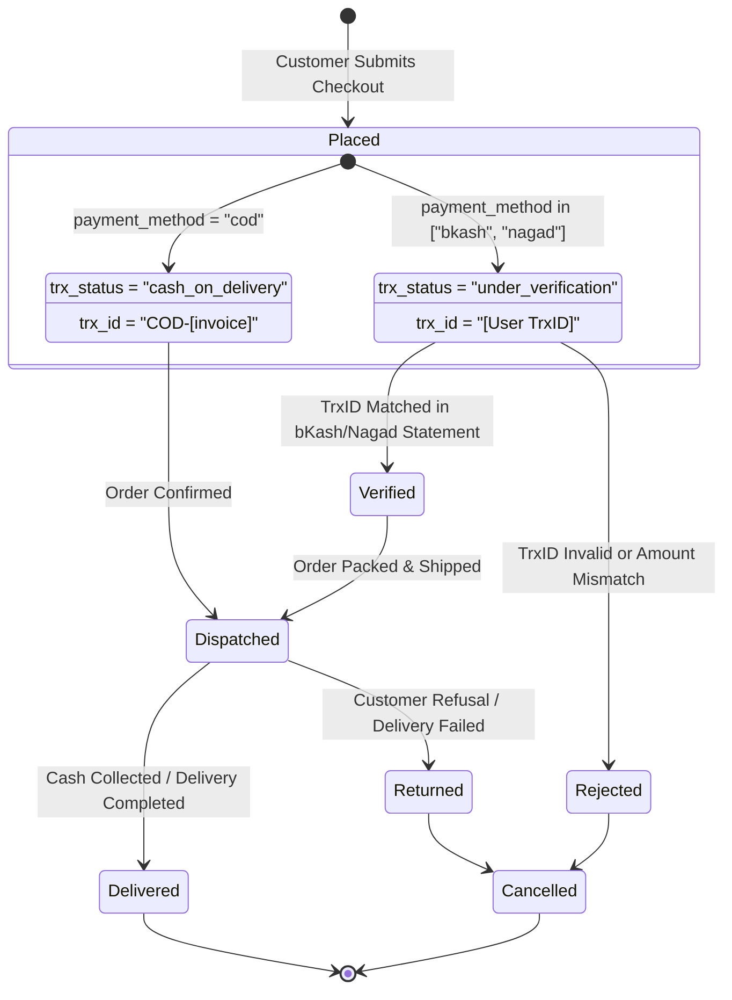

# Technical Requirements Document (TRD)
## Rawgad E-Commerce Payment & Order Management System

---

## 1. Document Overview & System Architecture

### 1.1 Objective
This Technical Requirements Document (TRD) defines the data architecture, database schema, operational workflows, and API specifications for the **Rawgad** e-commerce order management system. The system supports direct, friction-free checkout focused exclusively on **Cash on Delivery (COD)** and **Transaction ID (TrxID) based Mobile Financial Services (bKash & Nagad)**.

### 1.2 High-Level Architecture
The architecture comprises a serverless, decoupled stack deployed on Vercel and connected to MongoDB Atlas:

```mermaid
flowchart TD
    subgraph Client ["Client Layer (Browser)"]
        Cart["Alpine.js Cart Store (Local Storage)"]
        CheckoutUI["Checkout Page (checkout.html)"]
        ThankUI["Confirmation Page (thank.html)"]
    end

    subgraph Serverless ["Serverless API Layer (Node.js)"]
        API_Checkout["POST /api/checkout"]
        API_Coupon["POST /api/coupon"]
        DB_Helper["DB Connection Pool (api/_db.js)"]
    end

    subgraph Database ["Persistence Layer (MongoDB Atlas)"]
        DB_Orders[("Database: paystationdemo\nCollection: orders")]
    end

    Cart -->|Cart State| CheckoutUI
    CheckoutUI -->|Validate Coupon| API_Coupon
    CheckoutUI -->|Place Order (COD / bKash / Nagad)| API_Checkout
    API_Checkout --> DB_Helper
    DB_Helper -->|Insert Document| DB_Orders
    API_Checkout -->|Success & Invoice Number| CheckoutUI
    CheckoutUI -->|Redirect with Trx Details| ThankUI
```

---

## 2. Database & Collection Architecture

### 2.1 Database Overview
- **Database Engine**: MongoDB 6.x / 7.x (MongoDB Atlas Multi-Tenant or Dedicated Cluster)
- **Target Database Name**: `paystationdemo` (Configurable via standard `MONGO_URI`)
- **Connection Manager**: `api/_db.js` using `MongoClient` with serverless connection pooling (`maxPoolSize: 10`, `serverSelectionTimeoutMS: 8000`).

### 2.2 Collections Specification
| Collection Name | Purpose | Primary Key | Estimated Volume |
| :--- | :--- | :--- | :--- |
| **`orders`** | Primary ledger for customer orders, payment transaction details, and delivery fulfillment. | `_id` (ObjectId) | Write-heavy, long-term persistence |

---

## 3. MongoDB Data Schema Specification

### 3.1 Document JSON Schema (`orders` collection)

```json
{
  "$jsonSchema": {
    "bsonType": "object",
    "required": [
      "invoice_number",
      "subtotal",
      "payment_amount",
      "currency",
      "payment_method",
      "status",
      "trx_status",
      "trx_id",
      "verified",
      "customer",
      "items",
      "created_at",
      "updated_at"
    ],
    "properties": {
      "_id": {
        "bsonType": "objectId"
      },
      "invoice_number": {
        "bsonType": "string",
        "description": "Unique alphanumeric order invoice identifier (e.g., INV-6AA6B9...)"
      },
      "subtotal": {
        "bsonType": ["double", "int", "long"],
        "minimum": 0,
        "description": "Gross total amount of line items before discounts"
      },
      "discount_amount": {
        "bsonType": ["double", "int", "long"],
        "minimum": 0,
        "description": "Deduction amount derived from promotional coupon code"
      },
      "coupon_code": {
        "bsonType": ["string", "null"],
        "description": "Uppercase coupon code applied, or null if no discount"
      },
      "delivery_charge": {
        "bsonType": ["double", "int", "long"],
        "minimum": 0,
        "description": "Shipping fee in BDT (defaults to 0 for free shipping)"
      },
      "payment_amount": {
        "bsonType": ["double", "int", "long"],
        "minimum": 0,
        "description": "Net payable amount in BDT (subtotal - discount + delivery)"
      },
      "currency": {
        "bsonType": "string",
        "enum": ["BDT"],
        "description": "ISO currency code (fixed to BDT)"
      },
      "payment_method": {
        "bsonType": "string",
        "enum": ["cod", "bkash", "nagad"],
        "description": "Selected checkout payment mechanism"
      },
      "status": {
        "bsonType": "string",
        "enum": ["pending", "confirmed", "processing", "shipped", "delivered", "cancelled"],
        "description": "Order fulfillment lifecycle state"
      },
      "trx_status": {
        "bsonType": "string",
        "enum": ["cash_on_delivery", "under_verification", "verified", "rejected"],
        "description": "Payment verification state"
      },
      "trx_id": {
        "bsonType": "string",
        "description": "Transaction identifier (COD-[invoice] for COD, or customer TrxID for bKash/Nagad)"
      },
      "sender_number": {
        "bsonType": ["string", "null"],
        "pattern": "^01[0-9]{9}$",
        "description": "11-digit Bangladeshi mobile number used to execute MFS payment"
      },
      "verified": {
        "bsonType": "bool",
        "description": "Boolean flag indicating whether transaction has been audited"
      },
      "customer": {
        "bsonType": "object",
        "required": ["name", "phone", "email", "full_address"],
        "properties": {
          "name": {
            "bsonType": "string",
            "maxLength": 100,
            "description": "Customer full legal name"
          },
          "phone": {
            "bsonType": "string",
            "pattern": "^01[0-9]{9}$",
            "description": "Customer contact mobile number (11 digits)"
          },
          "email": {
            "bsonType": "string",
            "maxLength": 200,
            "description": "Customer email address for invoice communication"
          },
          "full_address": {
            "bsonType": "string",
            "minLength": 5,
            "maxLength": 300,
            "description": "Complete physical street and city delivery address"
          }
        }
      },
      "items": {
        "bsonType": "array",
        "minItems": 1,
        "items": {
          "bsonType": "object",
          "required": ["id", "name", "price", "qty", "subtotal"],
          "properties": {
            "id": {
              "bsonType": "string",
              "description": "Unique product SKU or identifier"
            },
            "name": {
              "bsonType": "string",
              "description": "Title of the purchased product"
            },
            "price": {
              "bsonType": ["double", "int", "long"],
              "minimum": 0,
              "description": "Unit price at the time of purchase"
            },
            "qty": {
              "bsonType": ["int", "long"],
              "minimum": 1,
              "description": "Quantity ordered"
            },
            "subtotal": {
              "bsonType": ["double", "int", "long"],
              "minimum": 0,
              "description": "Calculated as price * qty"
            }
          }
        }
      },
      "created_at": {
        "bsonType": "date",
        "description": "UTC timestamp of order creation"
      },
      "updated_at": {
        "bsonType": "date",
        "description": "UTC timestamp of latest state modification"
      }
    }
  }
}
```

---

### 3.2 Field Dictionary

| Field | Type | Nullable | Description / Rules |
| :--- | :--- | :---: | :--- |
| `_id` | `ObjectId` | No | Unique MongoDB auto-generated document primary key. |
| `invoice_number` | `String` | No | Human-readable unique identifier with prefix `INV-` (indexed unique). |
| `subtotal` | `Double` | No | Sum total of line items before discounts. |
| `discount_amount` | `Double` | No | Deducted amount from coupon (defaults to `0`). |
| `coupon_code` | `String` | Yes | Coupon applied during checkout (e.g. `RAWGAD10`), or `null`. |
| `delivery_charge` | `Double` | No | Shipping fee in BDT. |
| `payment_amount` | `Double` | No | Net payable total: `Math.max(0, subtotal - discount + delivery)`. |
| `currency` | `String` | No | Standard currency indicator, always `"BDT"`. |
| `payment_method` | `String` | No | Either `"cod"`, `"bkash"`, or `"nagad"`. |
| `status` | `String` | No | Order pipeline state: `"pending"`, `"confirmed"`, `"shipped"`, `"delivered"`, `"cancelled"`. |
| `trx_status` | `String` | No | Payment audit state: `"cash_on_delivery"`, `"under_verification"`, `"verified"`, `"rejected"`. |
| `trx_id` | `String` | No | `COD-[invoice_number]` for COD; customer-submitted TrxID for bKash/Nagad. |
| `sender_number` | `String` | Yes | 11-digit phone number from which bKash/Nagad transfer was made. |
| `verified` | `Boolean` | No | Set to `false` on initial submission; changed to `true` upon manual reconciliation. |
| `customer.name` | `String` | No | Customer full name (1-100 characters). |
| `customer.phone` | `String` | No | Customer phone number (11 digits, regex: `^01[0-9]{9}$`). |
| `customer.email` | `String` | No | Customer contact email. |
| `customer.full_address`| `String` | No | Physical delivery address (5-300 characters). |
| `items[].id` | `String` | No | Product identifier or SKU. |
| `items[].name` | `String` | No | Product title. |
| `items[].price` | `Double` | No | Unit price in BDT. |
| `items[].qty` | `Integer`| No | Number of units purchased (min: 1). |
| `items[].subtotal` | `Double` | No | Product unit price multiplied by quantity. |
| `created_at` | `Date` | No | ISO timestamp when the order record was inserted. |
| `updated_at` | `Date` | No | ISO timestamp when the record was last modified. |

---

### 3.3 Sample MongoDB Documents

#### Example A: Cash on Delivery (COD) Order
```json
{
  "_id": { "$oid": "66f4a8b9176849a8eb343e01" },
  "invoice_number": "INV-66F4A8B9176849A8EB343E01",
  "subtotal": 3500.00,
  "discount_amount": 350.00,
  "coupon_code": "RAWGAD10",
  "delivery_charge": 0.00,
  "payment_amount": 3150.00,
  "currency": "BDT",
  "payment_method": "cod",
  "status": "pending",
  "trx_status": "cash_on_delivery",
  "trx_id": "COD-INV-66F4A8B9176849A8EB343E01",
  "sender_number": null,
  "verified": false,
  "customer": {
    "name": "Syed Adnan Rahman",
    "phone": "01712345678",
    "email": "adnan@example.com",
    "full_address": "House 14, Road 5, Block C, Banani, Dhaka"
  },
  "items": [
    {
      "id": "prod_001",
      "name": "Precision Engineered Watch",
      "price": 3500.00,
      "qty": 1,
      "subtotal": 3500.00
    }
  ],
  "created_at": { "$date": "2026-09-13T15:00:00.000Z" },
  "updated_at": { "$date": "2026-09-13T15:00:00.000Z" }
}
```

#### Example B: bKash Transaction ID Order
```json
{
  "_id": { "$oid": "66f4a8b9176849a8eb343e02" },
  "invoice_number": "INV-66F4A8B9176849A8EB343E02",
  "subtotal": 5200.00,
  "discount_amount": 0.00,
  "coupon_code": null,
  "delivery_charge": 0.00,
  "payment_amount": 5200.00,
  "currency": "BDT",
  "payment_method": "bkash",
  "status": "pending",
  "trx_status": "under_verification",
  "trx_id": "9J87A2KX",
  "sender_number": "01812345678",
  "verified": false,
  "customer": {
    "name": "Tanvir Hasan",
    "phone": "01798765432",
    "email": "tanvir@example.com",
    "full_address": "Flat 4B, Concord Tower, Gulshan-2, Dhaka"
  },
  "items": [
    {
      "id": "prod_004",
      "name": "Carbon Leather Wallet",
      "price": 2600.00,
      "qty": 2,
      "subtotal": 5200.00
    }
  ],
  "created_at": { "$date": "2026-09-13T15:10:00.000Z" },
  "updated_at": { "$date": "2026-09-13T15:10:00.000Z" }
}
```

#### Example C: Nagad Transaction ID Order
```json
{
  "_id": { "$oid": "66f4a8b9176849a8eb343e03" },
  "invoice_number": "INV-66F4A8B9176849A8EB343E03",
  "subtotal": 2400.00,
  "discount_amount": 240.00,
  "coupon_code": "RAWGAD10",
  "delivery_charge": 0.00,
  "payment_amount": 2160.00,
  "currency": "BDT",
  "payment_method": "nagad",
  "status": "pending",
  "trx_status": "under_verification",
  "trx_id": "7HN35MK9",
  "sender_number": "01611223344",
  "verified": false,
  "customer": {
    "name": "Mahmudul Karim",
    "phone": "01611223344",
    "email": "mahmud@example.com",
    "full_address": "House 22, Road 3, Dhanmondi, Dhaka"
  },
  "items": [
    {
      "id": "prod_002",
      "name": "Minimalist Cardholder",
      "price": 2400.00,
      "qty": 1,
      "subtotal": 2400.00
    }
  ],
  "created_at": { "$date": "2026-09-13T15:15:00.000Z" },
  "updated_at": { "$date": "2026-09-13T15:15:00.000Z" }
}
```

---

## 4. Indexing Strategy & Query Optimization

To maintain sub-10ms query execution times as order volume expands, the following indexes are specified for the `orders` collection:

```javascript
// Unique invoice lookup
db.orders.createIndex({ "invoice_number": 1 }, { unique: true, name: "idx_invoice_unique" });

// Customer order history & lookup by phone
db.orders.createIndex({ "customer.phone": 1, "created_at": -1 }, { name: "idx_cust_phone_created" });

// Admin & accounting auditing by payment method and verification status
db.orders.createIndex({ "payment_method": 1, "trx_status": 1, "created_at": -1 }, { name: "idx_method_trx_status" });

// Transaction ID deduplication and lookup
db.orders.createIndex({ "trx_id": 1 }, { sparse: true, name: "idx_trx_id" });

// Chronological sorting for fulfillment queues
db.orders.createIndex({ "status": 1, "created_at": -1 }, { name: "idx_status_created" });
```

---

## 5. Payment & Order Lifecycle State Machine



---

## 6. API Endpoint Technical Specifications

### 6.1 `POST /api/checkout`
- **Location**: [`api/checkout.js`](file:///C:/Users/victus/Documents/Rawgadz_05/final_public/api/checkout.js)
- **Content-Type**: `application/json`
- **Access Control**: CORS enabled (`*`), OPTIONS preflight supported.

#### Request Payload:
```json
{
  "cust_name": "string (Required)",
  "cust_phone": "string (Required, 11 digits: 01XXXXXXXXX)",
  "cust_email": "string (Required, valid email)",
  "cust_address": "string (Required, min 5 chars)",
  "payment_method": "string (Required: 'cod' | 'bkash' | 'nagad')",
  "trx_id": "string (Required if bkash/nagad, min 4 chars)",
  "sender_number": "string (Optional/Required if bkash/nagad, 11 digits)",
  "amount": "number (Optional fallback total)",
  "coupon_code": "string (Optional, e.g. 'RAWGAD10')",
  "cartItems": [
    {
      "id": "prod_001",
      "title": "Product Title",
      "price": 1200,
      "quantity": 1
    }
  ]
}
```

#### Success Response (HTTP 200):
```json
{
  "success": true,
  "payment_method": "bkash",
  "invoice_number": "INV-66F4A8B9176849A8EB343E02",
  "trx_id": "9J87A2KX",
  "message": "Order placed successfully! Your bKash payment is under verification.",
  "redirect_url": "/thank.html?invoice_number=INV-66F4A8B9176849A8EB343E02&method=bkash&trx_id=9J87A2KX"
}
```

#### Error Response (HTTP 400):
```json
{
  "error": "Please enter a valid bKash Transaction ID (TrxID)"
}
```

---

### 6.2 `POST /api/coupon`
- **Location**: [`api/coupon.js`](file:///C:/Users/victus/Documents/Rawgadz_05/final_public/api/coupon.js)
- **Validation**: Compares against `process.env.COUPON_CODE` (default: `RAWGAD10`).
- **Success (HTTP 200)**:
  ```json
  {
    "valid": true,
    "coupon_code": "RAWGAD10",
    "discount_percent": 10,
    "message": "Coupon 'RAWGAD10' applied successfully! (10% OFF)"
  }
  ```

---

## 7. Environment Variables Configuration

| Variable | Default Value | Purpose |
| :--- | :--- | :--- |
| `MONGO_URI` | *None* | MongoDB Atlas connection string (e.g. `mongodb+srv://<user>:<pwd>@cluster.mongodb.net/paystationdemo?retryWrites=true&w=majority`). |
| `COUPON_CODE` | `RAWGAD10` | Active discount coupon code. |
| `COUPON_DISCOUNT_PERCENT` | `10` | Percentage discount deducted when the coupon is applied. |

---

## 8. Summary of Active File Footprint

```
final_public/
├── api/
│   ├── _db.js          # Shared MongoDB client singleton & pool
│   ├── checkout.js     # Unified order processor (COD, bKash, Nagad)
│   └── coupon.js       # Coupon validation endpoint
├── checkout.html       # Customer checkout page with interactive MFS & COD
├── checkout02.html     # Mirror checkout template
├── thank.html          # Dynamic order receipt and TrxID verification badge
└── update.md           # This Technical Requirements Document (TRD)
```
