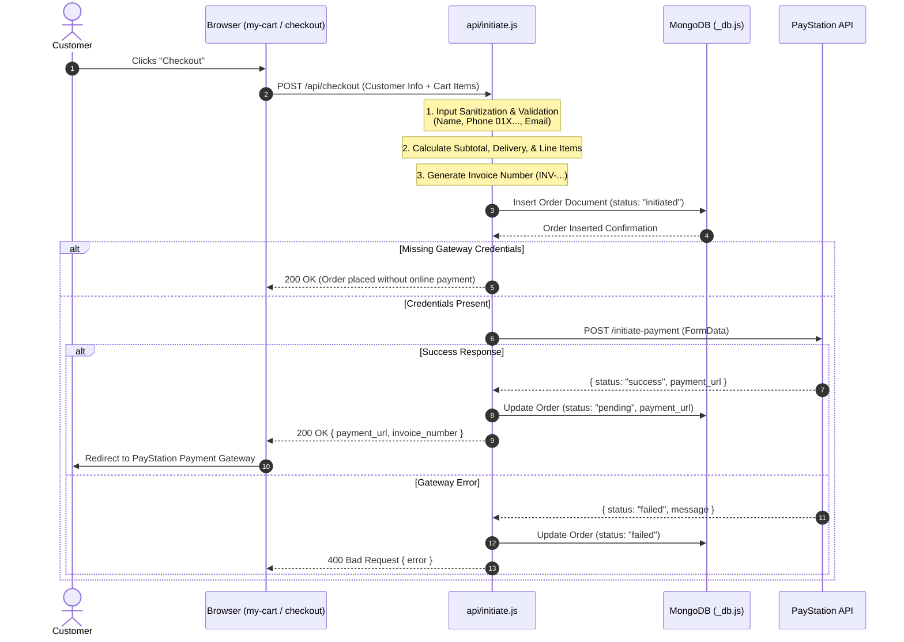
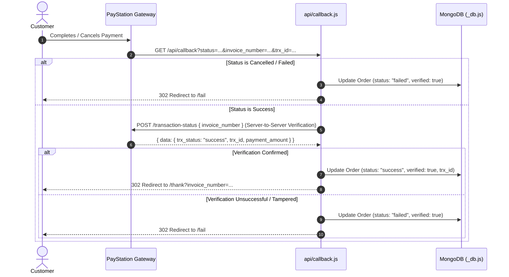

# API Data Flow Map & Architecture Documentation

This document provides a comprehensive data flow map and architectural breakdown of the serverless backend endpoints located in the [`api/`](file:///C:/Users/victus/Documents/RawGadz/Lit/api) folder.

---

## 1. Overview & Architecture Diagram

The backend API handles shopping cart checkout, order persistence in **MongoDB**, and secure online payment processing via the **PayStation Payment Gateway**.

```mermaid
flowchart TD
    Client["Client App / Browser\n(Lit Web Components)"]
    
    subgraph API ["Vercel Serverless API (/api)"]
        CheckoutEndpoint["/api/checkout\n(api/checkout.js)"]
        InitiateEndpoint["/api/initiate\n(api/initiate.js)"]
        CallbackEndpoint["/api/callback\n(api/callback.js)"]
        DBHelper["DB Module\n(api/_db.js)"]
    end
    
    Database[(MongoDB\npaystationdemo.orders)]
    PayStation[PayStation Gateway\napi.paystation.com.bd]
    
    %% Flow 1: Initiate Order
    Client -->|1. POST /api/checkout or /api/initiate| CheckoutEndpoint
    CheckoutEndpoint --> InitiateEndpoint
    InitiateEndpoint -->|2. Connect & Insert Order| DBHelper
    DBHelper -->|3. Save Initial Order| Database
    InitiateEndpoint -->|4. POST FormData /initiate-payment| PayStation
    PayStation -->|5. Return payment_url| InitiateEndpoint
    InitiateEndpoint -->|6. Return { payment_url }| Client
    Client -->|7. User Redirect to payment_url| PayStation
    
    %% Flow 2: Payment Callback
    PayStation -->|8. GET /api/callback?status=...&invoice_number=...| CallbackEndpoint
    CallbackEndpoint -->|9. Verify TRX Status POST /transaction-status| PayStation
    CallbackEndpoint -->|10. Update Order Status| DBHelper
    CallbackEndpoint -->|11. 302 Redirect /thank or /fail| Client
```

---

## 2. Component File Breakdown

| File | Type | Route / Function | Description |
| :--- | :--- | :--- | :--- |
| [`api/_db.js`](file:///C:/Users/victus/Documents/RawGadz/Lit/api/_db.js) | Utility | `getDb()` | Singleton MongoDB connection manager with connection pooling and health checks. |
| [`api/checkout.js`](file:///C:/Users/victus/Documents/RawGadz/Lit/api/checkout.js) | Serverless Handler | `POST /api/checkout` | Entry-point wrapper proxying checkout requests directly to `initiate.js`. |
| [`api/initiate.js`](file:///C:/Users/victus/Documents/RawGadz/Lit/api/initiate.js) | Serverless Handler | `POST /api/initiate` | Validates customer data, calculates order totals, persists order to DB, & initializes gateway transaction. |
| [`api/callback.js`](file:///C:/Users/victus/Documents/RawGadz/Lit/api/callback.js) | Serverless Handler | `GET /api/callback` | Webhook/redirect callback handling payment status verification and customer redirects (`/thank` or `/fail`). |

---

## 3. Detailed Data Flow Pipelines

### Pipeline A: Checkout & Order Initiation Pipeline



---

### Pipeline B: Payment Gateway Callback & Status Verification



---

## 4. Database Data Schemas

### MongoDB Collection: `paystationdemo.orders`

| Field | Type | Description |
| :--- | :--- | :--- |
| `invoice_number` | `String` | Unique invoice code (e.g. `INV-64f1a...`) |
| `subtotal` | `Number` | Sum of item prices x quantities (BDT) |
| `delivery_charge` | `Number` | Total delivery fees (BDT) |
| `payment_amount` | `Number` | Grand total paid by customer |
| `currency` | `String` | Always `"BDT"` |
| `status` | `String` | `"initiated"` \| `"pending"` \| `"success"` \| `"failed"` \| `"pending_verification"` |
| `verified` | `Boolean` | Server-side gateway verification state |
| `customer` | `Object` | `{ name, phone, email, jela, thana, address_detail, full_address }` |
| `items` | `Array` | List of line item objects `{ id, name, price, delivery, qty, subtotal }` |
| `checkout_items` | `String` | Summarized text of items for gateway payload |
| `callback_url` | `String` | Dynamic callback endpoint URL |
| `payment_url` | `String` | URL returned by PayStation gateway |
| `trx_id` | `String` | Transaction ID issued by gateway/bank |
| `created_at` | `Date` | Timestamp of order creation |
| `updated_at` | `Date` | Timestamp of last status modification |

---

## 5. Environment Variables Required

| Variable | Description |
| :--- | :--- |
| `MONGO_URI` | Connection URI for MongoDB cluster |
| `PAYSTATION_ENV` | Gateway environment mode (`live` vs `sandbox`) |
| `MERCHANT_ID` | PayStation Merchant ID |
| `PAYSTATION_PASSWORD` | PayStation API Password |
| `APP_URL` | Base application URL (e.g., `https://your-domain.vercel.app`) |