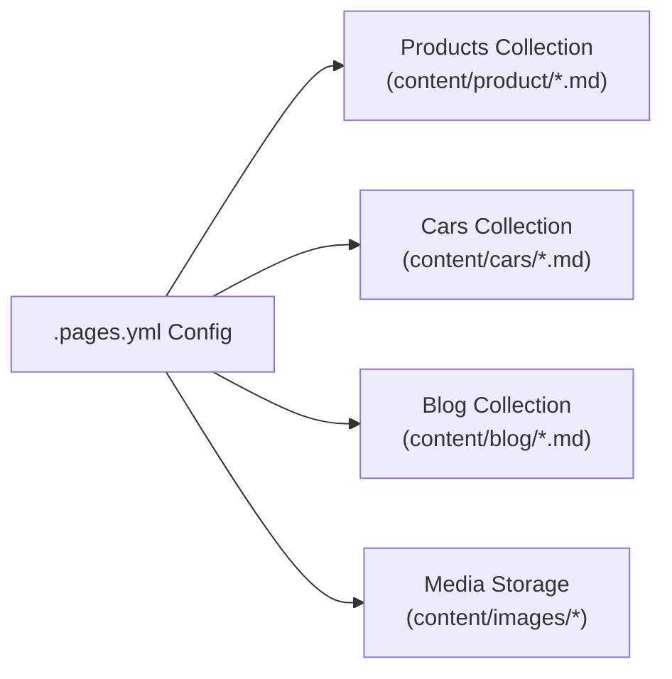
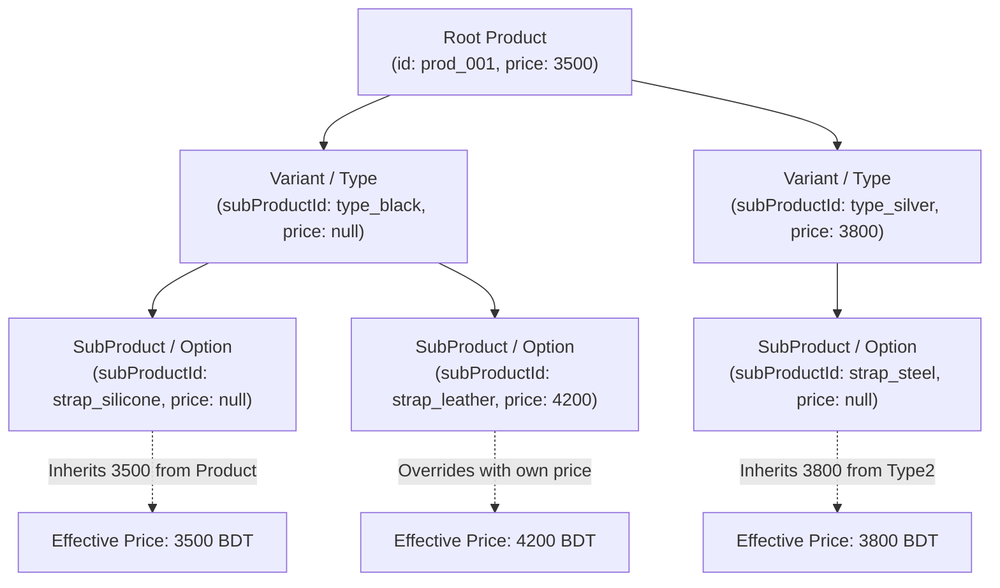
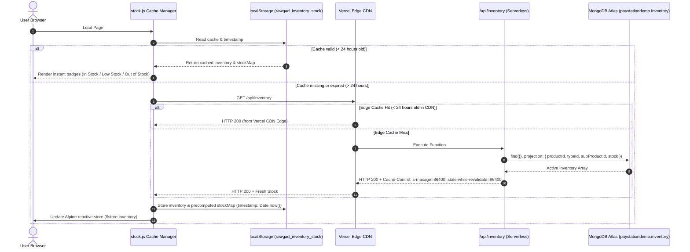
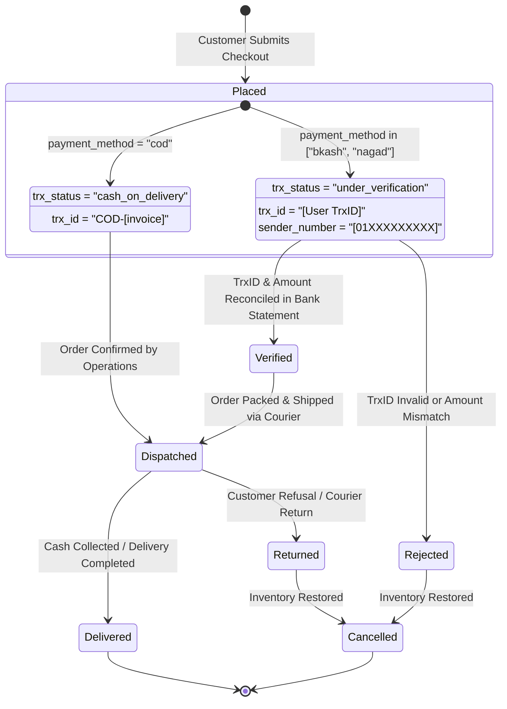

# System Architecture & Technical Specifications Document
## Rawgadz E-Commerce, Automotive & Content Management Platform

---

## 1. Executive Architectural Overview

**Rawgadz** is a modern, high-performance Jamstack e-commerce and automotive showcase platform engineered for modern minimalists. It combines static site generation (SSG) for ultra-fast page delivery, a headless Git-based content management system (Pages CMS), client-side reactive state management (Alpine.js & Tailwind CSS), a multi-layer hybrid inventory caching architecture, and a serverless backend (Node.js on Vercel) backed by MongoDB Atlas.

### 1.1 Core Architectural Principles

- **Zero-Hydration Static Speed**: Catalog browsing, product display, automotive showcases, and blog posts are pre-rendered into static HTML during the build pipeline. No runtime database queries or client-side rendering waterfalls are required to display products.
- **Git-Based Headless Content Management**: Marketing teams and content creators edit Markdown files via Pages CMS (`.pages.yml`). Changes committed to Git trigger deterministic build scripts that compile structured JSON catalogs and standalone HTML pages.
- **Hybrid 24-Hour Inventory Caching**: Real-time inventory synchronization is balanced against high concurrency and edge performance using a 24-hour client `localStorage` cache coupled with Vercel Edge CDN headers (`s-maxage=86400, stale-while-revalidate=86400`) and atomic server-side stock decrement during checkout.
- **Frictionless Localized Checkout**: Engineered specifically for the Bangladesh e-commerce ecosystem, featuring dynamic district/upazila address resolution (`bd-locations.js`), zone-based shipping calculations (Dhaka: ৳60, Outside Dhaka: ৳90), Cash on Delivery (COD), and direct Mobile Financial Services (MFS: bKash & Nagad) with manual Transaction ID (TrxID) reconciliation.
- **ACID-Compliant Serverless Transactions**: Checkout requests execute atomic stock validation and decrements against MongoDB Atlas, falling back to compensating-transaction rollbacks when executed in standalone non-replica cluster environments.

---

### 1.2 High-Level End-to-End System Architecture

```mermaid
flowchart TD
    subgraph CMS ["Content Authoring & Media Layer"]
        PagesCMS["Pages CMS (.pages.yml)"]
        MD_Products["Markdown Products\n(content/product/*.md)"]
        MD_Cars["Markdown Cars\n(content/cars/*.md)"]
        MD_Blog["Markdown Blog Posts\n(content/blog/*.md)"]
        Img_Assets["Media Assets\n(content/images/*)"]
        PagesCMS -->|Commits Content| MD_Products & MD_Cars & MD_Blog & Img_Assets
    end

    subgraph SSG ["Build & Static Site Generation (Node.js)"]
        Script_Products["build-products.js"]
        Script_Cars["build-car.js & build-html-cars.js"]
        Script_Blog["build-blog.js & build-html-blog.js"]
        
        MD_Products --> Script_Products
        MD_Cars --> Script_Cars
        MD_Blog --> Script_Blog
        
        Script_Products --> JSON_Products["products.json\n(root & public/)"]
        Script_Products --> HTML_Products["product/*.html\n(Standalone Slug Pages)"]
        Script_Products --> HTML_Gadgets["gadgets.html\n(Filtered Gadgets Catalog)"]
        
        Script_Cars --> JSON_Cars["cars.json\n(root & public/)"]
        Script_Cars --> HTML_Cars["cr/*.html\n(Automotive Showcases)"]
        
        Script_Blog --> JSON_Blog["blog.json\n(root & public/)"]
        Script_Blog --> HTML_Blog["blog/*.html\n(Blog Article Pages)"]
    end

    subgraph Client ["Client Browser Runtime"]
        Alpine_App["Alpine.js Reactive Stores\n($store.cart, $store.inventory)"]
        Stock_Client["Client Stock Manager (stock.js)\n24h localStorage Cache"]
        Loc_Module["BD Locations (bd-locations.js)\n64 Districts & Upazilas"]
        UI_Pages["Storefront Pages\n(index.html, gadgets.html, car.html, blog.html)"]
        UI_Checkout["Checkout Interface\n(checkout.html / checkout02.html)"]
        UI_Thank["Confirmation / Receipt\n(thank.html)"]
        
        Stock_Client <-->|O(1) Stock Map| Alpine_App
        Alpine_App <--> UI_Pages & UI_Checkout
        Loc_Module --> UI_Checkout
    end

    subgraph Edge ["Vercel Edge Network & Serverless API"]
        Edge_Cache["Vercel Edge CDN Cache\n(s-maxage=86400, stale-while-revalidate=86400)"]
        API_Inv["GET/POST /api/inventory"]
        API_Checkout["POST /api/checkout"]
        API_Coupon["POST /api/coupon"]
        DB_Pool["Connection Pool Singleton\n(api/_db.js)"]
        
        Stock_Client -->|Fetch Bulk Stock| Edge_Cache
        Edge_Cache -->|Cache Miss / Revalidate| API_Inv
        UI_Checkout -->|Apply Discount| API_Coupon
        UI_Checkout -->|Execute Order| API_Checkout
        API_Inv & API_Checkout --> DB_Pool
    end

    subgraph Database ["Persistence Layer (MongoDB Atlas)"]
        Col_Inventory[("Collection: inventory\n(paystationdemo)")]
        Col_Orders[("Collection: orders\n(paystationdemo)")]
        DB_Pool --> Col_Inventory
        DB_Pool --> Col_Orders
    end

    subgraph External ["External Services & Webhooks"]
        Google_Sheet["Google Apps Script Webhooks\n(Newsletter & Contact Forms)"]
        UI_Pages & UI_Thank & UI_Checkout -->|Form Webhook| Google_Sheet
    end

    API_Checkout -->|Atomic Stock Decrement| Col_Inventory
    API_Checkout -->|Insert Order Document| Col_Orders
    API_Checkout -->|Redirect URL & Invoice| UI_Checkout
    UI_Checkout -->|Navigate| UI_Thank
```

---

## 2. Technology Stack & Architectural Decision Records

| Layer | Technology | Version / Spec | Purpose & Architectural Rationale |
| :--- | :--- | :--- | :--- |
| **Static Runtime** | HTML5, Alpine.js | 3.13.x (CDN) | Lightweight (15kb), declarative reactive component logic without heavy single-page application (SPA) virtual DOM overhead. |
| **CSS Framework** | Tailwind CSS | 3.x (Play CDN) | Utility-first styling enabling atomic, mobile-first responsive interfaces across devices. |
| **SSG Engines** | Node.js, `gray-matter`, `marked` | `gray-matter ^4.0.3`<br>`marked ^14.0.0` | Converts frontmatter Markdown into normalized JSON databases and pre-baked HTML views at build time. |
| **Content Management** | Pages CMS | YAML frontmatter (`.pages.yml`) | Headless Git-native editor interface for editorial non-developer staff. |
| **Client Caching** | LocalStorage & Custom Cache Driver | `stock.js` | 24-hour client-side inventory caching avoiding repeated API hits during storefront browsing. |
| **Serverless API** | Node.js Serverless Functions | Vercel Edge / Node runtime | Zero-maintenance scalable micro-endpoints for `/api/checkout`, `/api/inventory`, and `/api/coupon`. |
| **Database Engine** | MongoDB Atlas | 6.x / 7.x (`mongodb ^6.3.0`) | Document persistence supporting JSON document schemas, flexible variant structures, and ACID transaction sessions. |
| **Localization** | UMD Vanilla JS Module | `bd-locations.js` | Embedded offline hierarchy of all 64 districts and upazilas across Bangladesh with Dhaka shipping detection. |
| **Hosting & CI/CD** | Vercel | Vercel Platform v2 | Clean URLs, zero-config serverless deployments, automatic build hooks (`npm run build`). |

---

## 3. Directory & File Organization

```
final_public/
├── .env                          # Local environment variables (ignored in Git)
├── .env.example                  # Template of required and optional environment keys
├── .pages.yml                    # Pages CMS schema definition for products, cars, and blog
├── bd-locations.js               # Bangladesh 64 Districts & Upazilas dataset (UMD module)
├── blog.html                     # Blog archive listing page
├── blog.json                     # Compiled blog articles database (SSG artifact)
├── build.js                      # Root SSG builder wrapper
├── build-blog.js                 # Compiles content/blog/*.md to blog.json
├── build-car.js                  # Compiles content/cars/*.md to cars.json
├── build-html-blog.js            # Compiles blog.json to standalone blog/*.html pages
├── build-html-cars.js            # Compiles cars.json to standalone cr/*.html pages
├── build-products.js             # Compiles content/product/*.md to products.json, product/*.html, gadgets.html
├── car.html                      # Automotive fleet showcase landing page
├── cars.json                     # Compiled automotive vehicles database (SSG artifact)
├── checkout.html                 # Production checkout page (COD, bKash, Nagad, BD shipping)
├── checkout02.html               # Secondary checkout page mirror/template
├── contact.html                  # Customer contact and inquiry form
├── fail.html                     # Payment failure and cancellation screen
├── gadgets.html                  # Filtered catalog page dedicated to gadget category
├── index.html                    # Storefront homepage and primary catalog
├── package.json                  # NPM dependencies and SSG pipeline scripts
├── package-lock.json             # NPM deterministic lockfile
├── products.json                 # Compiled master products database (SSG artifact)
├── seed-inventory.js             # CLI utility to seed/sync MongoDB inventory from products.json
├── skill.md                      # Agent skill configuration and project notes
├── stock.js                      # Universal 24-hour client-side inventory cache manager
├── tailwind.config.js            # Tailwind CSS compiler configuration
├── test.html                     # Local development storefront sandbox
├── thank.html                    # Order confirmation, receipt & TrxID verification badge
├── update.md                     # This System Architecture & Technical Specifications Document
├── vercel.json                   # Vercel deployment, edge caching headers & build configuration
├── api/
│   ├── _db.js                    # MongoDB client singleton pool & index auto-ensurance
│   ├── checkout.js               # Order processing engine (atomic inventory decrement & validation)
│   ├── coupon.js                 # Coupon discount validation endpoint
│   └── inventory.js              # Live stock & availability API (Edge CDN cached)
├── blog/
│   ├── blog_001.html             # Pre-rendered static blog post 1
│   ├── blog_002.html             # Pre-rendered static blog post 2
│   └── blog_003.html             # Pre-rendered static blog post 3
├── content/
│   ├── blog/                     # Markdown source files for blog articles
│   ├── cars/                     # Markdown source files for automotive fleet
│   ├── images/                   # Uploaded media assets managed by Pages CMS
│   └── product/                  # Markdown source files for e-commerce products
├── cr/
│   ├── car_001.html              # Pre-rendered static car showcase 1
│   ├── car_002.html              # Pre-rendered static car showcase 2
│   ├── car_003.html              # Pre-rendered static car showcase 3
│   └── car_004.html              # Pre-rendered static car showcase 4
├── product/                      # Pre-rendered static standalone product pages (${slug}.html)
├── public/                       # Mirrored static assets and compiled JSON copies
│   ├── blog.json
│   ├── cars.json
│   ├── products.json
│   └── stock.js
└── scratch/                      # Automated test scripts and diagnostic utilities
    ├── check-db.js               # Database connectivity verification
    ├── debug-422.js              # Validation debugger
    ├── free-quota.js             # M0 quota monitor
    ├── inspect-cluster.js        # MongoDB cluster state inspector
    ├── seed-orders.js            # Test order seeder
    ├── test-build-system.js      # Comprehensive build system test suite
    ├── test-cache-system.js      # Edge headers & 24h client cache test suite
    └── test-order-api.js         # Checkout endpoint regression test suite
```

---

## 4. Headless Content Architecture (Pages CMS & Markdown)

The editorial layer is powered by **Pages CMS**, configured via [`.pages.yml`](file:///C:/Users/victus/Documents/Rawgadz_05/final_public/.pages.yml). Editorial staff can manage media assets and 3 primary collections directly inside GitHub:


```mermaid
flowchart LR
    A[".pages.yml Config"] --> B["Products Collection\n(content/product/*.md)"]
    A --> C["Cars Collection\n(content/cars/*.md)"]
    A --> D["Blog Collection\n(content/blog/*.md)"]
    A --> E["Media Storage\n(content/images/*)"]
```

### 4.1 Product Markdown Model (`content/product/*.md`)
Each product document contains YAML frontmatter and a rich-text markdown description:

```yaml
---
id: prod_009
slug: rsdfvsvf
tab: normal               # "normal" (displays on Home & Shop) or "gadget" (displays on gadgets.html)
title: rsdfvsvf

images:
  - https://placehold.co/600x400/EEE/31343C
  - https://placehold.co/600x400/DDD/31343C
  - https://placehold.co/600x400/CCC/31343C

description: ejfnjdnfibjuidsfw

price: 185

priceRange:
  min: 185
  max: 456

tags: ttt

types:
  - subProductId: prod_009_sub034
    subTitle: ds fhs

    images:
      - https://placehold.co/600x400/EEE/31343C
      - https://placehold.co/600x400/DDD/31343C

    price: 244

    subProducts:
      - subProductId: prod_009_sub034_sub01
        subTitle: dhbzuichjd

        images:
          - https://placehold.co/600x400/EEE/31343C
          - https://placehold.co/600x400/DDD/31343C

        price: 456
---

# Product Engineering & Features
Detailed markdown specifications, bullet lists, and technical breakdowns...
```

### 4.2 Vehicle Markdown Model (`content/cars/*.md`)
Supports starting MSRP, YouTube integration, trim levels, and option packages:

```yaml
---
id: car_001
title: "Rawgad Apex GT"
imageSrc: "https://example.com/car.png"
youtube: "kU_tEwQ6Z_E"
description: "Twin-turbocharged V8 track weapon."
price: 185000
tags: "sports, track, v8"
types:
  - subProductId: trim_track
    subTitle: "Track Edition"
    price: 195000
    subProducts:
      - subProductId: aero_carbon
        subTitle: "Carbon Aero Package"
        price: 210000
---
```

### 4.3 Blog Article Model (`content/blog/*.md`)
```yaml
---
id: blog_001
title: "The Architecture of Modern Minimalist Tech"
date: "2026-08-08"
author: "Rawgadz Engineering"
excerpt: "A deep dive into clean design patterns and hardware aesthetics."
imageSrc: "https://example.com/blog1.png"
tags: "design, engineering, minimalism"
---
```

---

## 5. Build System & Static Site Generation (SSG)

The build system operates completely offline without network dependencies. Running `npm run build` triggers a chained execution:

```
npm run build ➔
  1. node build-products.js
  2. node build-blog.js
  3. node build-html-blog.js
  4. node build-car.js
  5. node build-html-cars.js
```

### 5.1 Compilation Pipelines & Artifact Outputs

| Script | Input Directory | Primary Outputs | Output Behavior & Features |
| :--- | :--- | :--- | :--- |
| [`build-products.js`](file:///C:/Users/victus/Documents/Rawgadz_05/final_public/build-products.js) | `content/product/*.md` | `products.json`<br>`public/products.json`<br>`product/${slug}.html`<br>`gadgets.html` | - Resolves recursive variant & subproduct trees with `images` lists and `priceRange` (min/max).<br>- Enforces price inheritance.<br>- Generates dynamic Variant Images Gallery section below main product card.<br>- Validates slug uniqueness to eliminate collisions.<br>- Cleans old stale HTML pages in `product/`.<br>- Embeds full product data as JSON within standalone pages (0 network fetch).<br>- Clones `index.html` into `gadgets.html` with updated navigation and `p.tab === 'gadget'` filter. |
| [`build-car.js`](file:///C:/Users/victus/Documents/Rawgadz_05/final_public/build-car.js) | `content/cars/*.md` | `cars.json`<br>`public/cars.json` | - Normalizes trim editions and option packages.<br>- Parses Markdown bodies using `marked`.<br>- Sorts records deterministically by ID. |
| [`build-html-cars.js`](file:///C:/Users/victus/Documents/Rawgadz_05/final_public/build-html-cars.js) | `cars.json` | `cr/car_*.html` | - Pre-renders responsive vehicle showcase pages with custom dropdown variant selectors. |
| [`build-blog.js`](file:///C:/Users/victus/Documents/Rawgadz_05/final_public/build-blog.js) | `content/blog/*.md` | `blog.json`<br>`public/blog.json` | - Extracts author, tags, date, excerpt, and parsed HTML body. |
| [`build-html-blog.js`](file:///C:/Users/victus/Documents/Rawgadz_05/final_public/build-html-blog.js) | `blog.json` | `blog/blog_*.html` | - Generates SEO-optimized reading views with responsive navigation and cart drawer. |

---

## 6. Product Variant & Pricing Inheritance Architecture

Rawgadz utilizes a three-tier hierarchical SKU resolution model:


```mermaid
flowchart TD
    Product["Root Product\n(id: prod_001, price: 3500)"]
    Type1["Variant / Type\n(subProductId: type_black, price: null)"]
    Type2["Variant / Type\n(subProductId: type_silver, price: 3800)"]
    Sub1["SubProduct / Option\n(subProductId: strap_silicone, price: null)"]
    Sub2["SubProduct / Option\n(subProductId: strap_leather, price: 4200)"]
    Sub3["SubProduct / Option\n(subProductId: strap_steel, price: null)"]

    Product --> Type1
    Product --> Type2
    Type1 --> Sub1
    Type1 --> Sub2
    Type2 --> Sub3

    Sub1 -.->|Inherits 3500 from Product| Sub1_Price["Effective Price: 3500 BDT"]
    Sub2 -.->|Overrides with own price| Sub2_Price["Effective Price: 4200 BDT"]
    Sub3 -.->|Inherits 3800 from Type2| Sub3_Price["Effective Price: 3800 BDT"]
```

### 6.1 Composite Lookup Keys
To enable instantaneous lookup both on the client (`stock.js`) and server (`api/checkout.js`), inventory items and prices are indexed using composite keys:
1. **Triple Key**: `productId:::typeId:::subProductId` (e.g. `prod_001:::type_black:::strap_leather`)
2. **Variant Pair Key**: `typeId:::subProductId` (e.g. `type_black:::strap_leather`)
3. **SubProduct Key**: `subProductId` (e.g. `strap_leather`)
4. **Type Key**: `typeId` (when variant has no nested options)
5. **Product Key**: `productId` (base fallback)

---

## 7. Inventory Synchronization & 24-Hour Hybrid Caching

Inventory availability must prevent overselling while maintaining high availability and zero database strain under viral traffic.


```mermaid
sequenceDiagram
    autonumber
    actor Customer as User Browser
    participant StockJS as stock.js Cache Manager
    participant LocalStore as localStorage (rawgad_inventory_stock)
    participant Edge as Vercel Edge CDN
    participant API as /api/inventory (Serverless)
    participant DB as MongoDB Atlas (paystationdemo.inventory)

    Customer->>StockJS: Load Page
    StockJS->>LocalStore: Read cache & timestamp
    alt Cache valid (< 24 hours old)
        LocalStore-->>StockJS: Return cached inventory & stockMap
        StockJS-->>Customer: Render instant badges (In Stock / Low Stock / Out of Stock)
    else Cache missing or expired (> 24 hours)
        StockJS->>Edge: GET /api/inventory
        alt Edge Cache Hit (< 24 hours old in CDN)
            Edge-->>StockJS: HTTP 200 (from Vercel CDN Edge)
        else Edge Cache Miss
            Edge->>API: Execute Function
            API->>DB: find({}, projection: { productId, typeId, subProductId, stock })
            DB-->>API: Active Inventory Array
            API-->>Edge: HTTP 200 + Cache-Control: s-maxage=86400, stale-while-revalidate=86400
            Edge-->>StockJS: HTTP 200 + Fresh Stock
        end
        StockJS->>LocalStore: Store inventory & precomputed stockMap (timestamp: Date.now())
        StockJS->>Customer: Update Alpine reactive store ($store.inventory)
    end
```

### 7.1 Cache Invalidation Upon Purchase
When an order is successfully confirmed in [`checkout.html`](file:///C:/Users/victus/Documents/Rawgadz_05/final_public/checkout.html#L1205-L1208):
```javascript
// Clear Cart & invalidate cached inventory to reflect decremented stock
Alpine.store('cart').clear();
try {
  localStorage.removeItem('rawgad_inventory_stock');
} catch (_) {}
```
This forces the subsequent page load to fetch decremented stock figures from the serverless edge.

---

## 8. Database Architecture & Schemas (MongoDB Atlas)

- **Database Engine**: MongoDB 6.x / 7.x
- **Target Database**: `paystationdemo`
- **Connection Helper**: [`api/_db.js`](file:///C:/Users/victus/Documents/Rawgadz_05/final_public/api/_db.js) with connection pooling (`maxPoolSize: 10`, `serverSelectionTimeoutMS: 8000`).

### 8.1 Collection: `inventory`

Stores live stock counts per purchasable variant or SKU.

#### Schema Definition:
| Field | BSON Type | Indexed | Description |
| :--- | :--- | :---: | :--- |
| `_id` | `ObjectId` | PK | Document primary key. |
| `productId` | `String` | Yes | Parent product SKU / identifier (e.g. `prod_001`). |
| `typeId` | `String \| null` | Yes | Variant ID (e.g. `type_black`) or null if none. |
| `subProductId`| `String \| null` | Yes | Sub-variant ID (e.g. `strap_leather`) or null if none. |
| `stock` | `Int32` | No | Real-time available units (decremented during checkout). |
| `createdAt` | `Date` | No | Timestamp of initial document insertion. |
| `updatedAt` | `Date` | No | Timestamp of latest stock decrement or sync. |

#### Compound Unique Index:
```javascript
db.inventory.createIndex(
  { productId: 1, typeId: 1, subProductId: 1 },
  { unique: true, name: "idx_prod_type_sub_unique" }
);
```

---

### 8.2 Collection: `orders`

Immutable financial ledger for customer checkout submissions.

#### Schema Definition:
```json
{
  "$jsonSchema": {
    "bsonType": "object",
    "required": [
      "invoice_number",
      "subtotal",
      "payment_amount",
      "currency",
      "payment_method",
      "status",
      "trx_status",
      "trx_id",
      "verified",
      "customer",
      "items",
      "created_at",
      "updated_at"
    ],
    "properties": {
      "_id": { "bsonType": "objectId" },
      "invoice_number": { "bsonType": "string" },
      "subtotal": { "bsonType": ["double", "int", "long"], "minimum": 0 },
      "discount_amount": { "bsonType": ["double", "int", "long"], "minimum": 0 },
      "coupon_code": { "bsonType": ["string", "null"] },
      "delivery_charge": { "bsonType": ["double", "int", "long"], "minimum": 0 },
      "payment_amount": { "bsonType": ["double", "int", "long"], "minimum": 0 },
      "currency": { "bsonType": "string", "enum": ["BDT"] },
      "payment_method": { "bsonType": "string", "enum": ["cod", "bkash", "nagad"] },
      "status": {
        "bsonType": "string",
        "enum": ["pending", "confirmed", "processing", "shipped", "delivered", "cancelled"]
      },
      "trx_status": {
        "bsonType": "string",
        "enum": ["cash_on_delivery", "under_verification", "verified", "rejected"]
      },
      "trx_id": { "bsonType": "string" },
      "sender_number": { "bsonType": ["string", "null"], "pattern": "^01[0-9]{9}$" },
      "verified": { "bsonType": "bool" },
      "customer": {
        "bsonType": "object",
        "required": ["name", "phone", "email", "full_address"],
        "properties": {
          "name": { "bsonType": "string", "maxLength": 100 },
          "phone": { "bsonType": "string", "pattern": "^01[0-9]{9}$" },
          "email": { "bsonType": "string", "maxLength": 200 },
          "full_address": { "bsonType": "string", "minLength": 5, "maxLength": 300 }
        }
      },
      "items": {
        "bsonType": "array",
        "minItems": 1,
        "items": {
          "bsonType": "object",
          "required": ["id", "name", "price", "qty", "subtotal"],
          "properties": {
            "id": { "bsonType": "string" },
            "subProductId": { "bsonType": ["string", "null"] },
            "name": { "bsonType": "string" },
            "price": { "bsonType": ["double", "int", "long"], "minimum": 0 },
            "qty": { "bsonType": ["int", "long"], "minimum": 1 },
            "subtotal": { "bsonType": ["double", "int", "long"], "minimum": 0 }
          }
        }
      },
      "created_at": { "bsonType": "date" },
      "updated_at": { "bsonType": "date" }
    }
  }
}
```

#### Indexing Strategy:
```javascript
// Unique invoice lookup
db.orders.createIndex({ "invoice_number": 1 }, { unique: true });

// Customer order history & lookups
db.orders.createIndex({ "customer.phone": 1, "created_at": -1 });

// Payment reconciliation query optimization
db.orders.createIndex({ "payment_method": 1, "trx_status": 1, "created_at": -1 });

// TrxID deduplication
db.orders.createIndex({ "trx_id": 1 }, { sparse: true });

// Fulfillment sorting
db.orders.createIndex({ "status": 1, "created_at": -1 });
```

---

## 9. Order Lifecycle & Payment State Machine


```mermaid
stateDiagram-v2
    [*] --> Placed: Customer Submits Checkout

    state Placed {
        [*] --> COD_Pending: payment_method = "cod"
        [*] --> MFS_Pending: payment_method in ["bkash", "nagad"]
        
        COD_Pending: trx_status = "cash_on_delivery"
        COD_Pending: trx_id = "COD-[invoice]"
        
        MFS_Pending: trx_status = "under_verification"
        MFS_Pending: trx_id = "[User TrxID]"
        MFS_Pending: sender_number = "[01XXXXXXXXX]"
    }

    COD_Pending --> Dispatched: Order Confirmed by Operations
    MFS_Pending --> Verified: TrxID & Amount Reconciled in Bank Statement
    MFS_Pending --> Rejected: TrxID Invalid or Amount Mismatch

    Verified --> Dispatched: Order Packed & Shipped via Courier
    Dispatched --> Delivered: Cash Collected / Delivery Completed
    Dispatched --> Returned: Customer Refusal / Courier Return

    Rejected --> Cancelled: Inventory Restored
    Returned --> Cancelled: Inventory Restored
    Delivered --> [*]
    Cancelled --> [*]
```

---

## 10. Serverless API Endpoint Specifications

### 10.1 `POST /api/checkout`
- **File**: [`api/checkout.js`](file:///C:/Users/victus/Documents/Rawgadz_05/final_public/api/checkout.js)
- **CORS**: `Access-Control-Allow-Origin: *` (OPTIONS preflight supported)
- **Atomicity**: Executes within a MongoDB Client Session (`withTransaction`). If transactions are unsupported (e.g. standalone Mongo instance), automatically falls back to conditional atomic updates with compensating rollback loops.

#### Request Body Schema:
```json
{
  "cust_name": "Rahim Ahmed",
  "cust_phone": "01711223344",
  "cust_email": "rahim@example.com",
  "cust_address": "House 12, Road 4, Sector 3, Uttara, Dhaka",
  "payment_method": "bkash",
  "trx_id": "9J87A2KX",
  "sender_number": "01711223344",
  "coupon_code": "RAWGADZ10",
  "cartItems": [
    {
      "id": "prod_001",
      "typeId": "type_black",
      "subProductId": "strap_leather",
      "price": 4200,
      "quantity": 1
    }
  ]
}
```

#### Success Response (200 OK):
```json
{
  "success": true,
  "payment_method": "bkash",
  "invoice_number": "INV-66F4A8B9176849A8EB343E02",
  "trx_id": "9J87A2KX",
  "message": "Order placed successfully! Your bKash payment is under verification.",
  "redirect_url": "/thank.html?invoice_number=INV-66F4A8B9176849A8EB343E02&method=bkash&trx_id=9J87A2KX"
}
```

#### Error Response (400 Bad Request):
```json
{
  "success": false,
  "error": "Insufficient stock for \"Italian Leather Strap\". Requested 2, but only 1 available."
}
```

---

### 10.2 `GET /api/inventory` & `POST /api/inventory`
- **File**: [`api/inventory.js`](file:///C:/Users/victus/Documents/Rawgadz_05/final_public/api/inventory.js)
- **Edge Cache Headers (GET)**:
  - `Cache-Control: public, max-age=0, s-maxage=86400, stale-while-revalidate=86400`
  - `CDN-Cache-Control: public, s-maxage=86400, stale-while-revalidate=86400`
  - `Vercel-CDN-Cache-Control: public, s-maxage=86400, stale-while-revalidate=86400`
- **Parameters (GET)**:
  - `?productId=prod_001` (Returns all variants for product)
  - `?productId=prod_001&typeId=type_black&subProductId=strap_leather` (Specific item lookup)
  - No params: Returns full inventory list.
- **POST Body**:
  - `{ "items": [{ "productId": "prod_001", "typeId": "...", "subProductId": "..." }] }` or `{ "productIds": ["prod_001"] }`

---

### 10.3 `POST /api/coupon`
- **File**: [`api/coupon.js`](file:///C:/Users/victus/Documents/Rawgadz_05/final_public/api/coupon.js)
- **Validation**: Compares input against `process.env.COUPON_CODE` (default: `RAWGADZ10`, with support for legacy `RAWGAD10`).
- **Response**:
```json
{
  "valid": true,
  "coupon_code": "RAWGADZ10",
  "discount_percent": 10,
  "message": "Coupon 'RAWGADZ10' applied successfully! (10% OFF)"
}
```

---

## 11. Client-Side Localization & State Management

### 11.1 Bangladesh Geographic Data & Dynamic Shipping (`bd-locations.js`)
- Exposes `window.BD_LOCATIONS` with all 64 Bangladesh districts mapped to their respective Upazilas/Thanas.
- **Shipping Rule**:
  - **Dhaka District**: ৳60 BDT delivery charge.
  - **All Other Districts**: ৳90 BDT delivery charge.
- Supports both standard two-level dropdown selection and custom text input mode for remote unions or unlisted areas.

### 11.2 Alpine.js Global Stores

#### 1. Cart Store (`$store.cart`):
- Persistent across pages via `localStorage.getItem('main_store_cart')`.
- Listens to cross-tab `storage` and `cart-update-main_store_cart` window events.
- Exposes `itemsArray`, `totalCount`, `totalPrice`, `updateQuantity(id, qty)`, and `clear()`.

#### 2. Inventory Store (`$store.inventory`):
- Initialized by `stock.js` on `alpine:init`.
- Provides reactive methods `getItemStock(productId, typeId, subProductId)` and `refresh(force)`.

### 11.3 Storefront Product Cards & Standalone Variant Gallery
- **Home & Catalog Section (`index.html` & `gadgets.html`)**:
  - Each product card displays the computed price range (`BDT min - max` if variable, or `BDT price` if static) using `p.priceRange`.
  - The direct "Buy Now" button is omitted from cards in favor of a single dedicated `Type` action button that navigates directly to the standalone product page (`./product/${slug}.html`).
- **Standalone Product Pages (`product/${slug}.html`)**:
  - Customers select their desired variant (`types`) and sub-variants (`subProducts`), displaying the actual unit price (`currentPrice`) with interactive "Add to Cart" and "Buy Now" controls.
  - **Mobile View Responsive Image Gallery**: In mobile view (`< md`), the product image gallery is displayed on the left side of the main section's preview area with very little width (`w-12 sm:w-14`), featuring a sleek vertical thumbnail list with touch scrolling, active border highlights, and instant click previewing next to the main product image.
  - **Desktop View Variant Gallery Section**: In desktop view (`>= md`), a dedicated **Variant Gallery Section** below the main product card displays a comprehensive grid of all photos associated with the currently selected variant (`currentVariantImages`), allowing users to browse and switch between thumbnails.

### 11.4 3D Carousel Architecture (`index.json` & `gadgets.json`)
- **Decoupled Carousel Datasets**:
  - [`index.json`](file:///C:/Users/victus/Documents/Rawgadz_05/final_public/index.json) & [`public/index.json`](file:///C:/Users/victus/Documents/Rawgadz_05/final_public/public/index.json): Powers the 3D rotating category carousel on the homepage ([`index.html`](file:///C:/Users/victus/Documents/Rawgadz_05/final_public/index.html)).
  - [`gadgets.json`](file:///C:/Users/victus/Documents/Rawgadz_05/final_public/gadgets.json) & [`public/gadgets.json`](file:///C:/Users/victus/Documents/Rawgadz_05/final_public/public/gadgets.json): Powers the 3D rotating category carousel on the gadgets catalog page ([`gadgets.html`](file:///C:/Users/victus/Documents/Rawgadz_05/final_public/gadgets.html)).
- **Schema Format**:
  ```json
  [
    {
      "image": "https://example.com/image.png",
      "tag": "tech",
      "label": "Tech Gear"
    }
  ]
  ```
  - `image`: URL of the card display photo (also supports `src` for backward compatibility).
  - `tag`: Category tag matched against product tags when clicked (`setFilter(tag, 'tags', '#shop')`).
  - `label`: Human-readable label displayed on the card pill (falls back to `tag`).
- **Dynamic Alpine.js Lifecycle**:
  - `indexPage` component holds `carouselSource` (`./index.json` by default).
  - `loadCarousel()` asynchronously fetches the configured JSON file, maps items, and invokes `cInit()` upon DOM resolution.
  - Safe guards against empty datasets prevent `NaN`/`Infinity` division before asynchronous load completion.
- **Build Pipeline Syncing**:
  - [`build-products.js`](file:///C:/Users/victus/Documents/Rawgadz_05/final_public/build-products.js) automatically mirrors `index.json` and `gadgets.json` to the `public/` directory during compilation and swaps `carouselSource` to `./gadgets.json` in `buildGadgetsPage()`.

---

## 12. Deployment Configuration & Environment Variables

### 12.1 Vercel Configuration (`vercel.json`)
```json
{
  "version": 2,
  "buildCommand": "npm run build",
  "outputDirectory": ".",
  "cleanUrls": true,
  "trailingSlash": false,
  "headers": [
    {
      "source": "/api/inventory",
      "headers": [
        { "key": "Cache-Control", "value": "public, max-age=0, s-maxage=86400, stale-while-revalidate=86400" },
        { "key": "CDN-Cache-Control", "value": "public, s-maxage=86400, stale-while-revalidate=86400" },
        { "key": "Vercel-CDN-Cache-Control", "value": "public, s-maxage=86400, stale-while-revalidate=86400" }
      ]
    }
  ]
}
```

### 12.2 Environment Variables

| Variable Name | Required | Default / Example Value | Description |
| :--- | :---: | :--- | :--- |
| `MONGO_URI` | Yes | `mongodb+srv://<user>:<pwd>@cluster0.mongodb.net/?retryWrites=true&w=majority` | Connection string for MongoDB Atlas cluster. |
| `APP_URL` | No | `http://localhost:3000` | Application root canonical URL. |
| `COUPON_CODE` | No | `RAWGADZ10` | Active discount code checked by checkout and coupon APIs. |
| `COUPON_DISCOUNT_PERCENT`| No | `10` | Discount deduction percentage. |
| `MERCHANT_ID` | No | `104-1653730183` | Legacy gateway merchant identifier. |
| `PAYSTATION_PASSWORD` | No | `gamecoderstorepass` | Legacy gateway credentials. |
| `PAYSTATION_ENV` | No | `sandbox` | Gateway environment mode (`sandbox` or `production`). |
| `PATHAO_BASE_URL` | No | `https://courier-api-sandbox.pathao.com` | Pathao Courier merchant sandbox endpoint. |
| `PATHAO_CLIENT_ID` | No | `7N1aMJQbWm` | Pathao Courier OAuth client ID. |
| `PATHAO_CLIENT_SECRET` | No | `wRcaibZkUd...` | Pathao Courier client secret key. |
| `PATHAO_USERNAME` | No | `test@pathao.com` | Pathao Courier merchant login user. |
| `PATHAO_PASSWORD` | No | `lovePathao` | Pathao Courier merchant account password. |
| `PATHAO_STORE_ID` | No | `12345` | Pathao fulfillment pickup warehouse ID. |

---

## 13. Verification, Testing & Tooling Scripts (`scratch/`)

The repository includes diagnostic and regression test suites in `scratch/`:

- [`scratch/test-build-system.js`](file:///C:/Users/victus/Documents/Rawgadz_05/final_public/scratch/test-build-system.js): Validates clean compilation of products, checks parity between `products.json` and `public/products.json`, checks standalone HTML slug filenames, and verifies `gadgets.html` generation.
- [`scratch/test-cache-system.js`](file:///C:/Users/victus/Documents/Rawgadz_05/final_public/scratch/test-cache-system.js): Tests Vercel Edge caching headers (`s-maxage=86400`), verifies POST non-caching (`no-store`), and verifies client-side 24-hour TTL caching algorithms.
- [`scratch/test-order-api.js`](file:///C:/Users/victus/Documents/Rawgadz_05/final_public/scratch/test-order-api.js): Tests COD, bKash, and Nagad order submissions against the API, verifying field sanitization, phone regex, and error codes.
- [`seed-inventory.js`](file:///C:/Users/victus/Documents/Rawgadz_05/final_public/seed-inventory.js): Parses the product hierarchy and seeds the MongoDB `inventory` collection with initial stock (default: 10 units per purchasable SKU).
